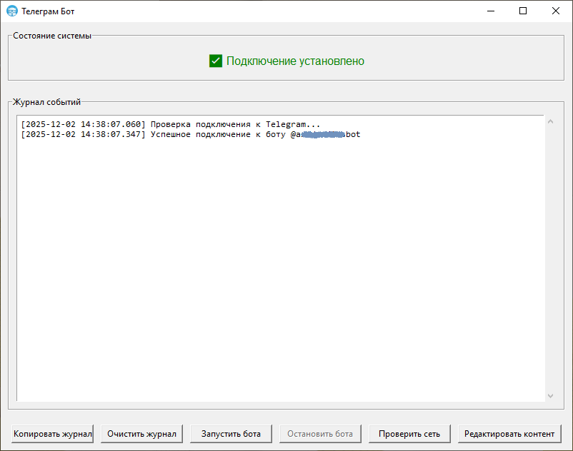

<div align="center">

# 🤖 Telegram Bot Pages Manager (Windows)

**Desktop application for Windows to create and manage Telegram bots with customizable pages**  
**Десктопное приложение для Windows для создания и управления Telegram-ботами с настраиваемыми страницами**

[](https://github.com/lonekocom/telegram-bot-pages/releases)
[](https://www.python.org/)
[](LICENSE)

[**Download Latest Release**](https://github.com/lonekocom/telegram-bot-pages-client/releases/download/v1.0.0/TelegramBot_Setup.exe) • 
[**Скачать последнюю версию**](https://github.com/lonekocom/telegram-bot-pages-client/releases/download/v1.0.0/TelegramBot_Setup.exe)



</div>

---

## [EN] English Version

### 📌 What This Is

A **Windows desktop application** built with Tkinter that allows you to:

1. **Create and configure Telegram bots** locally on your computer
2. **Design interactive pages** with text, images, and videos
3. **Manage bot content** through a visual editor
4. **Launch/stop bots** with one click


### 🚀 Quick Start Guide

#### Step 1: Get Bot Token
1. Open Telegram and find [@BotFather](https://t.me/BotFather)
2. Send `/newbot` and follow instructions
3. Copy the **API Token** you receive

#### Step 2: Run the Application
1. Download the latest `.exe` from [Releases](https://github.com/lonekocom/telegram-bot-pages/releases)
2. Run `TelegramBotApp.exe`
3. Paste your bot token in settings

#### Step 3: Create Your First Page
1. Click **"Редактировать контент"** (Edit Content)
2. Add a new page (text or video)
3. Add content: text, images, buttons
4. Save and close editor

#### Step 4: Launch Your Bot
1. Click **"Проверить сеть"** (Check Network) to verify connection
2. Click **"Запустить бота"** (Start Bot)
3. Test by sending `/start` to your bot in Telegram

### 📁 Project Structure
```
telegram-bot-pages/
├── main.py # Main application entry point
├── icon.ico # Application icon
├── content.json # Bot content and settings (auto-created)
├── media/ # Uploaded images and videos
│ └── [page_id]/ # Page-specific media files
├── logs/ # Application logs (auto-created)
│ └── бот_YYYY-MM-DD.log # Daily log files
└── README.md # This file
```
